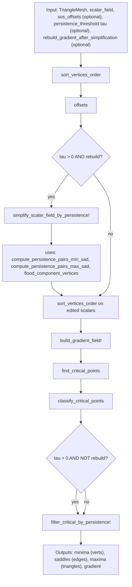
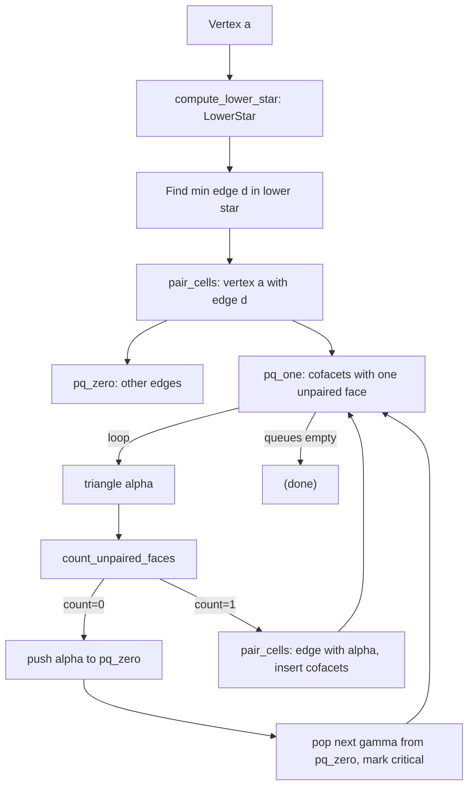
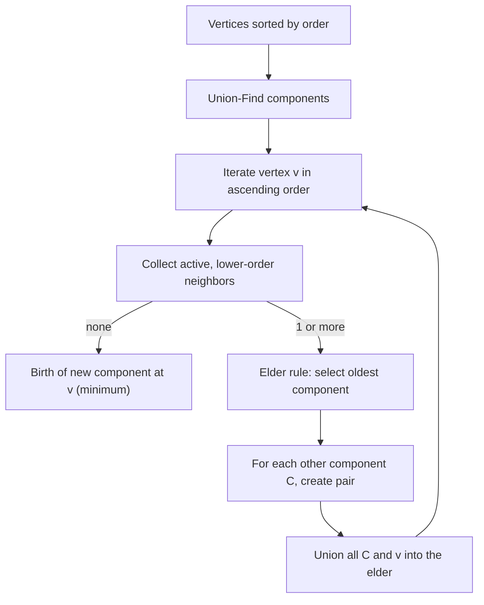

# Discrete Morse Critical Points in this Julia port

This note explains how Morse (discrete) critical points are computed by the provided Julia implementation in `discrete_morse_critical_points.jl`. It mirrors the TTK (Topology ToolKit) ProcessLowerStars algorithm and related components.

- Location: `discrete-morse-julia/discrete_morse_critical_points.jl`
- Scope: 2D triangle surface meshes (vertices, edges, triangles)
- Outputs: minima (vertices), saddles (edges), maxima (triangles), and the full discrete gradient field


## Referenced functions (where to look)

Core entry point and high-level pipeline:
- `find_critical_points_discrete_morse(mesh, scalar_field; sos_offsets=nothing, persistence_threshold=0.0, rebuild_gradient_after_simplification=true)` — main API. Returns `(minima, saddles, maxima, gradient)`.
- `sort_vertices_order(scalars, offsets)` — Total order of vertices with Simulation of Simplicity (SoS) tie-breakers.
- `simplify_scalar_field_by_persistence!(mesh, scalars, order, tau)` — Optional scalar edits that cancel topological noise below a persistence threshold (Local Topological Simplification intent). Uses persistence pairs and flood-fills.
- `build_gradient_field!(mesh, offsets, gradient)` — Builds the discrete gradient via ProcessLowerStars.
- `find_critical_points(mesh, gradient)` — Extracts critical cells from the completed gradient.
- `classify_critical_points(vertices, edges, triangles, mesh)` — Maps critical cells to (minima, saddles, maxima).
- `filter_critical_by_persistence!(...)` — Optional post-filtering without changing the gradient.

Lower-star (per-vertex) discrete gradient construction:
- `process_lower_star_vertex!(ls, a, offsets, mesh, gradient)` — Implements ProcessLowerStars for a single vertex `a`.
- `compute_lower_star!(ls, a, offsets, mesh)` — Builds the lower star cells (edges/triangles where `a` has the largest order among their vertices).
- `pair_cells!(alpha, beta, gradient)` — Records gradient pairings (0↔1 and 1↔2 pairs).
- `count_unpaired_faces_triangle(triangle, ls)` — Helper to decide if a triangle has exactly one unpaired edge in the lower star.

Persistence pairing and simplification helpers:
- `compute_persistence_pairs_min_sad(mesh, scalars, order)` — 0D pairs (min–1-saddle) via an elder-rule union-find.
- `compute_persistence_pairs_max_sad(mesh, scalars, order)` — 2D dual pairs (max–1-saddle) by running the 0D logic on negated scalars.
- `flood_component_vertices(mesh, scalars, start, threshold, mode, neigh)` — Sublevel/superlevel flood fills for scalar edits during simplification.

Data structures:
- `TriangleMesh` — Minimal mesh with connectivity (vertex–edge–triangle adjacencies).
- `GradientField` — Arrays encoding pairings: vertex↔edge and edge↔triangle.
- `LowerStar` / `CellExt` — Working sets for ProcessLowerStars per vertex.

Support:
- `get_critical_point_location`, `print_critical_point_summary`, `test_critical_point_detection()` — utilities and a simple test harness.


## End-to-end workflow



- SoS ordering is crucial to break ties consistently with TTK.
- If `persistence_threshold > 0` and `rebuild_gradient_after_simplification=true`, the scalar field is edited first, then the gradient is built on the simplified field (closest to TTK LTS behavior without full propagation machinery).
- Otherwise, the gradient is built first and a light-weight filtering can be applied to the reported lists.


## How the discrete gradient is built (ProcessLowerStars)

At a high level, the algorithm visits every vertex `a` and pairs cells within the lower star of `a` so that a gradient vector field is formed. Unpaired cells across all lower stars are the critical cells.



Key ideas:
- Lower star of `a`: all edges `(a,u)` and triangles `(a,u,v)` where `a` has the largest order. In code: `compute_lower_star!` compares `offsets[a]` to neighbors.
- The steepest incident lower edge is paired with `a` (so `a` won’t be critical unless no lower edges exist).
- Priority queues direct a local propagation that pairs edges with triangles when triangles have exactly one unpaired lower-star edge. Anything left unpaired in this local lower star becomes critical.

A tiny ASCII sketch of a lower star around `a`:
```
      v2
     /  \
 (a)----v1
     \\  /
       v3
```
- Edges `(a,v1)`, `(a,v2)`, `(a,v3)` whose neighbor has lower order than `a` belong to the lower star.
- Triangles like `(a,v1,v2)` belong if `a` has strictly greater order than both `v1` and `v2`.


## What makes a cell “critical” here?

After `build_gradient_field!`, a cell is critical if it has no gradient pairing:
- Vertex `v` is critical if `gradient.vertex_to_edge[v] == -1`.
- Edge `e` is critical if both `edge_to_vertex[e] == -1` and `edge_to_triangle[e] == -1`.
- Triangle `t` is critical if `gradient.triangle_to_edge[t] == -1`.

Code references:
- `is_critical_cell(cell, gradient, mesh)`
- `find_critical_points(mesh, gradient)` gathers all such cells and
- `classify_critical_points(...)` names them as minima, saddles, maxima respectively.


## Where persistence comes in (optional)

To remove low-persistence features, the code computes classical 0D and 2D pairs:



- `compute_persistence_pairs_min_sad` implements the elder-rule union-find on the 1-skeleton.
- `compute_persistence_pairs_max_sad` reuses the same logic on the negated scalars to produce max–saddle pairs.
- `simplify_scalar_field_by_persistence!` raises minima basins up to their merge level and lowers maxima domes down to their merge level (using `flood_component_vertices` to apply edits locally). After edits, the gradient is rebuilt on the simplified field.

Notes:
- Post-filtering with `filter_critical_by_persistence!` only prunes listings; it doesn’t alter the gradient.
- The rebuild path (`rebuild_gradient_after_simplification=true`) is the consistent way to reflect cancellations in the discrete gradient.


## Data and contracts

Inputs:
- `TriangleMesh`: positions, triangles, and precomputed connectivity (vertex→edges, edge→triangles, edge vertices)
- `scalar_field::Vector{<:Real}`: one value per vertex
- Optional: `sos_offsets::Vector{Int}` with the same length as the scalar field

Outputs:
- `minima::Vector{Int}` — indices of critical vertices
- `saddles::Vector{Int}` — indices of critical edges
- `maxima::Vector{Int}` — indices of critical triangles
- `gradient::GradientField` — pairing arrays

Edge cases covered:
- Flat plateaus: broken by SoS ordering (`sort_vertices_order`) or vertex index fallback.
- Isolated vertices in lower star: vertex becomes a minimum (no lower edges).
- Non-manifold edge→triangle counts: the lower-star logic only inspects triangles incident to the central vertex `a`; the mesh builder stores adjacency defensively.


## Try it locally

- Self-test entry point: `test_critical_point_detection()` in the same file.
- It builds a small 2×2 grid, assigns a simple scalar field, runs the pipeline, and prints a summary including an Euler characteristic check.

Optional run (from repo root):
- `julia discrete-morse-julia/discrete_morse_critical_points.jl`


## Quick checklist when reading the code

- Ordering: `sort_vertices_order` and `precondition_order_array`
- Gradient build: `build_gradient_field!` → `process_lower_star_vertex!` → `compute_lower_star!` and `pair_cells!`
- Critical extraction: `find_critical_points` + `classify_critical_points`
- Persistence (optional): `compute_persistence_pairs_*`, `simplify_scalar_field_by_persistence!`, `filter_critical_by_persistence!`


## References

- Robins, Wood, Sheppard (2000), “Computing Connected Components of 2D and 3D Images” — ProcessLowerStars foundation.
- TTK (Topology ToolKit) — C++ reference design mirrored by this port.
