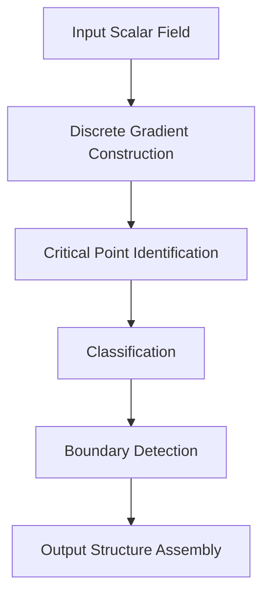
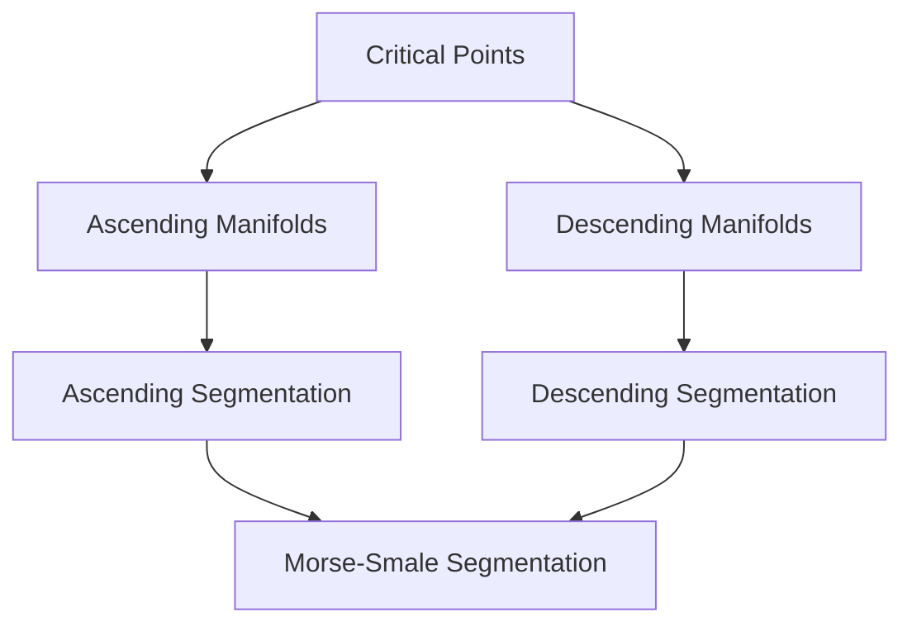

# ttkMorseSmaleComplex Architecture and Dependency Analysis

## Executive Summary

The `ttkMorseSmaleComplex` module is a sophisticated implementation of Morse-Smale complex computation for topological data analysis. It demonstrates advanced C++ design patterns, high-performance computing techniques, and deep integration within the TTK ecosystem. This report provides a comprehensive analysis of its architecture, dependencies, and implementation patterns.

## 1. Module Overview

### **Primary Purpose**
Computes Morse-Smale complexes from scalar fields on triangulated domains, providing:
- Critical point detection and classification
- 1-separatrix computation (gradient lines)
- 2-separatrix computation (separating surfaces in 3D)
- Morse-Smale segmentation of the domain

### **Module Structure**
```
ttkMorseSmaleComplex/
├── core/base/morseSmaleComplex/          # Core algorithm implementation
│   ├── MorseSmaleComplex.h              # Main class definition
│   ├── MorseSmaleComplex.cpp            # Implementation
│   └── CMakeLists.txt                   # Build configuration
└── core/vtk/ttkMorseSmaleComplex/       # VTK wrapper
    ├── ttkMorseSmaleComplex.h           # VTK integration class
    ├── ttkMorseSmaleComplex.cpp         # VTK implementation
    └── CMakeLists.txt                   # VTK build configuration
```

## 2. Base Implementation Architecture

### **2.1 Class Hierarchy**

```cpp
// Core inheritance pattern
class ttk::MorseSmaleComplex : virtual public ttk::Debug
{
  // Template-based algorithm implementation
  template <typename dataType, typename triangulationType>
  int execute(const dataType *const scalars,
              const SimplexId *const offsets,
              const triangulationType *triangulation);
};
```

**Design Pattern Analysis:**
- **Template Method Pattern**: `execute()` defines algorithm structure
- **Strategy Pattern**: Different triangulation types via templates
- **Composition Pattern**: Uses `DiscreteGradient` as component

### **2.2 Core Data Structures**

#### **Critical Points Output Structure**
```cpp
struct OutputCriticalPoints {
  std::vector<std::array<float, 3>> points_;           // 3D coordinates
  std::vector<char> cellDimensions_;                   // Topological dimension (0-3)
  std::vector<SimplexId> cellIds_;                     // Cell identifiers
  std::vector<char> isOnBoundary_;                     // Boundary classification
  std::vector<SimplexId> PLVertexIdentifiers_;        // Piecewise-linear vertices
  std::vector<SimplexId> manifoldSize_;                // Stable/unstable manifold sizes
};
```

**Architectural Insights:**
- **Structure of Arrays**: Optimized for cache efficiency
- **Parallel-friendly**: Each vector can be processed independently
- **Memory-efficient**: Uses smallest appropriate types (char, SimplexId)

#### **Separatrices Output Structure**
```cpp
struct Output1Separatrices {
  struct { // Point data
    SimplexId numberOfPoints_;
    std::vector<float> points_;              // 3D coordinates
    std::vector<char> smoothingMask_;        // Smoothing control
    std::vector<char> cellDimensions_;       // Source cell dimensions
    std::vector<ttk::SimplexId> cellIds_;    // Source cell IDs
  } pt;

  struct { // Cell connectivity
    SimplexId numberOfCells_;
    std::vector<ttk::SimplexId> connectivity_;  // Line connectivity
    std::vector<ttk::SimplexId> sourceIds_;     // Source critical points
    std::vector<ttk::SimplexId> destinationIds_; // Destination critical points
    std::vector<ttk::SimplexId> separatrixIds_; // Unique separatrix IDs
    std::vector<char> separatrixTypes_;         // Ascending/descending/connectors
    std::vector<char> isOnBoundary_;           // Boundary information
    std::vector<SimplexId> sepFuncMaxId_;       // Function maximum on separatrix
    std::vector<SimplexId> sepFuncMinId_;       // Function minimum on separatrix
  } cl;
};
```

**Design Benefits:**
- **Flat data structure**: Optimized for GPU/parallel processing
- **Rich metadata**: Comprehensive information for visualization
- **Scalable**: Handles large numbers of separatrices efficiently

### **2.3 Algorithm Architecture**

#### **Main Execution Pipeline**
```cpp
template <typename dataType, typename triangulationType>
int ttk::MorseSmaleComplex::execute(const dataType *const scalars,
                                    const SimplexId *const offsets,
                                    const triangulationType *triangulation)
{
  // 1. Gradient field construction
  discreteGradient_.buildGradient<triangulationType>(triangulation);

  // 2. Critical point extraction
  std::array<std::vector<SimplexId>, 4> criticalPoints{};
  discreteGradient_.getCriticalPoints(criticalPoints, triangulation);

  // 3. 1-separatrix computation
  getAscendingSeparatrices1(...);
  getDescendingSeparatrices1(...);
  getSaddleConnectors(...);

  // 4. 2-separatrix computation (3D only)
  if (triangulation->getDimensionality() == 3) {
    getAscendingSeparatrices2(...);
    getDescendingSeparatrices2(...);
  }

  // 5. Segmentation computation
  finalSaddleConnectors(...);
  ascendingManifold(...);
  descendingManifold(...);
  ascendingSegmentation(...);
  descendingSegmentation(...);
  morseSmaleSegmentation(...);

  return 0;
}
```

**Pipeline Characteristics:**
- **Modular design**: Each phase can be disabled/enabled independently
- **Memory-efficient**: Reuses data structures between phases
- **Progressive refinement**: Builds from simple to complex structures

## 3. VTK Wrapper Architecture

### **3.1 Integration Pattern**

```cpp
class ttkMorseSmaleComplex : public ttkAlgorithm,
                           protected ttk::MorseSmaleComplex
{
  // VTK-specific methods
  int FillOutputPortInformation(int port, vtkInformation* info) override;
  int RequestData(vtkInformation* request,
                  vtkInformationVector** inputVector,
                  vtkInformationVector* outputVector) override;
};
```

**Design Pattern:**
- **Adapter Pattern**: Bridges VTK pipeline with TTK algorithm
- **Multiple Inheritance**: Combines VTK and TTK interfaces
- **Template Dispatch**: Uses `ttkVtkTemplateMacro` for type safety

### **3.2 Multi-Output Architecture**

The wrapper provides **4 output ports**:

1. **Port 0: Critical Points** (`vtkPolyData`)
   - Point geometry with critical point locations
   - Cell data for point spheres
   - Scalar fields for classification

2. **Port 1: 1-Separatrices** (`vtkPolyData`)
   - Line connectivity for gradient paths
   - Source/destination critical point mapping
   - Separatrix type classification

3. **Port 2: 2-Separatrices** (`vtkPolyData`) - 3D only
   - Polygon connectivity for separating surfaces
   - Wall-type classification

4. **Port 3: Segmentation** (`vtkDataSet`)
   - Point data for ascending/descending manifolds
   - Final Morse-Smale segmentation

### **3.3 Parameter Management Interface**

Extensive parameter control via VTK:

```cpp
// Computation toggles
vtkSetMacro(ComputeCriticalPoints, bool);
vtkSetMacro(ComputeAscendingSeparatrices1, bool);
vtkSetMacro(ComputeDescendingSeparatrices1, bool);
vtkSetMacro(ComputeSaddleConnectors, bool);
vtkSetMacro(ComputeAscendingSeparatrices2, bool);
vtkSetMacro(ComputeDescendingSeparatrices2, bool);

// Threshold parameters
vtkSetMacro(ReturnSaddleConnectors, bool);
vtkSetMacro(SaddleConnectorsPersistenceThreshold, double);

// Post-processing options
vtkSetMacro(PrioritizeSpeedOverMemory, bool);
vtkSetMacro(ReverseSaddleConnectors, bool);
```

## 4. Dependency Analysis

### **4.1 Core TTK Dependencies**

#### **Primary Dependency: DiscreteGradient**
```cmake
# From CMakeLists.txt
DEPENDS
  discreteGradient      # Essential foundation
  discreteMorseSandwich # Advanced operations
```

**Integration Analysis:**
```cpp
// Direct composition pattern
dcg::DiscreteGradient discreteGradient_;

// Method delegation
discreteGradient_.buildGradient<triangulationType>(triangulation);
discreteGradient_.getCriticalPoints(criticalPoints, triangulation);
discreteGradient_.getAscendingPath(...);
discreteGradient_.getDescendingPath(...);
```

**Dependency Characteristics:**
- **Tight coupling**: DiscreteGradient is essential for core functionality
- **Interface stability**: Well-defined API boundaries
- **Performance critical**: Optimized for high-throughput operations

#### **Secondary Dependency: DiscreteMorseSandwich**
```cpp
// Used for advanced saddle connector operations
#include <DiscreteMorseSandwich.h>

// Integration in saddle connector computation
template <typename dataType, typename triangulationType>
int returnSaddleConnectors(...) {
  // Uses persistence-based simplification
  dmt::DiscreteMorseSandwich dms{};
  dms.buildSaddleSaddleConnections(...);
}
```

**Usage Pattern:**
- **Optional dependency**: Only used for advanced features
- **Persistence computation**: Provides topological simplification
- **Algorithmic enhancement**: Enables sophisticated cancellation operations

### **4.2 Triangulation System Integration**

#### **Abstract Interface Usage**
```cpp
template <typename triangulationType>
int execute(const dataType *const scalars,
            const SimplexId *const offsets,
            const triangulationType *triangulation)
{
  // Mesh queries
  const int dimensionality = triangulation->getDimensionality();
  const SimplexId numberOfVertices = triangulation->getNumberOfVertices();

  // Connectivity operations
  triangulation->getVertexNeighbor(vertexId, neighborId);
  triangulation->getCellVertex(cellId, localVertexId, vertexId);
}
```

**Integration Benefits:**
- **Type abstraction**: Supports multiple mesh representations
- **Performance optimization**: Template-based dispatch eliminates virtual overhead
- **Extensibility**: New triangulation types can be added without modification

### **4.3 Build Dependencies**

```cmake
# Core build configuration
set(SOURCES
  MorseSmaleComplex.cpp
)

# Include paths
target_include_directories(${PROJECT_NAME}
  PRIVATE ${TTK_BASE_INCLUDE_DIRS}
)

# Link dependencies
target_link_libraries(${PROJECT_NAME}
  PRIVATE discreteGradient
  PRIVATE discreteMorseSandwich
)
```

## 5. Key Algorithms and Data Flow

### **5.1 Critical Point Detection Pipeline**



**Algorithm Steps:**
1. **Gradient Construction**: Build discrete gradient field using ProcessLowerStars
2. **Critical Point Detection**: Identify cells without gradient arrows
3. **Classification**: Categorize by topological dimension (0-3D)
4. **Boundary Processing**: Distinguish interior vs. boundary critical points
5. **Output Assembly**: Populate OutputCriticalPoints structure

### **5.2 Separatrix Computation Algorithms**

#### **1-Separatrix Computation**
```cpp
template <typename dataType, typename triangulationType>
int getDescendingSeparatrices1(const std::vector<SimplexId> &saddles,
                              std::vector<Separatrix> &separatrices,
                              const triangulationType *triangulation)
{
  // For each 1-saddle
  #ifdef TTK_ENABLE_OPENMP
  #pragma omp parallel for num_threads(threadNumber_) schedule(dynamic)
  #endif
  for(size_t i = 0; i < saddles.size(); ++i) {
    // Find ascending V-paths from saddle vertices
    // Trace paths to maxima
    // Create separatrices with geometric representation
  }
}
```

**Key Features:**
- **Parallel processing**: Independent saddle computation
- **Dynamic scheduling**: Handles variable workloads
- **Path tracing**: Robust gradient following with cycle detection

#### **Saddle Connector Computation (3D Advanced)**
```cpp
template <typename dataType, typename triangulationType>
int getSaddleConnectors(const std::vector<SimplexId> &saddles1,
                       const std::vector<SimplexId> &saddles2,
                       std::vector<Separatrix> &separatrices,
                       const triangulationType *triangulation)
{
  // Uses DiscreteMorseSandwich for advanced computation
  dmt::DiscreteMorseSandwich dms{};
  dms.buildSaddleSaddleConnections(saddles1, saddles2, scalars,
                                  offsets, triangulation);
  // Extract and process saddle-saddle connections
}
```

**Advanced Capabilities:**
- **Persistence-based filtering**: Removes low-persistence connections
- **Topological consistency**: Maintains valid gradient field
- **Simplification control**: User-defined persistence thresholds

### **5.3 Segmentation Pipeline**



**Segmentation Process:**
1. **Ascending Manifolds**: Region of attraction for each critical point
2. **Descending Manifolds**: Region of influence for each critical point
3. **Final Segmentation**: Intersection of ascending and descending regions

## 6. Performance and Parallelization

### **6.1 Threading Strategy**

#### **OpenMP Integration Pattern**
```cpp
#ifdef TTK_ENABLE_OPENMP
#pragma omp parallel for num_threads(threadNumber_) schedule(dynamic)
#endif
for(size_t i = 0; i < workItems; ++i) {
  // Independent computation
}
```

**Threading Characteristics:**
- **Coarse-grained parallelism**: Independent saddle/region processing
- **Dynamic scheduling**: Adapts to variable computational costs
- **Thread safety**: Careful use of shared data structures

#### **Memory Access Optimization**
```cpp
// Structure of Arrays for cache efficiency
std::vector<float> points_;           // Contiguous 3D coordinates
std::vector<char> cellDimensions_;    // Contiguous dimensions
std::vector<SimplexId> cellIds_;      // Contiguous identifiers
```

**Performance Benefits:**
- **Cache-friendly**: Improves spatial locality
- **Vectorization-ready**: Enables SIMD optimizations
- **Memory bandwidth efficient**: Reduces cache misses

### **6.2 Memory Management Patterns**

#### **RAII and Automatic Resource Management**
```cpp
struct Output1Separatrices {
  void clear() {
    *this = {};  // Reset all vectors
  }

  ~Output1Separatrices() = default;  // Automatic cleanup
};
```

#### **Preconditioning for Performance**
```cpp
inline void preconditionTriangulation(AbstractTriangulation *const triangulation) {
  discreteGradient_.preconditionTriangulation(triangulation);
  triangulation->preconditionCellEdges();
  triangulation->preconditionCellNeighbors();
  triangulation->preconditionVertexStars();
}
```

**Preconditioning Benefits:**
- **Query acceleration**: Precomputes expensive mesh operations
- **Memory-time tradeoff**: Uses additional memory for speed
- **Batch optimization**: Minimizes repeated computations

### **6.3 Algorithmic Optimizations**

#### **Early Termination Strategies**
```cpp
// Threshold-based early exit
if(persistenceThreshold > 0.0) {
  if(currentPersistence < persistenceThreshold) {
    continue;  // Skip low-persistence features
  }
}
```

#### **Lazy Evaluation Pattern**
```cpp
// Compute only requested components
if(ComputeCriticalPoints) {
  // Critical point computation
}
if(ComputeAscendingSeparatrices1) {
  // Ascending separatrix computation
}
```

## 7. Integration with TTK Ecosystem

### **7.1 Pattern Consistency**

The module follows established TTK patterns:

- **Template-based design**: Consistent with other TTK modules
- **Debug integration**: Inherits from ttk::Debug for logging
- **Triangulation abstraction**: Uses standard mesh interface
- **VTK wrapper pattern**: Follows ttkAlgorithm inheritance

### **7.2 Code Reuse and Modularity**

```cpp
// Reusable component pattern
class MorseSmaleComplex : virtual public Debug {
  dcg::DiscreteGradient discreteGradient_;  // Reusable gradient engine
  // ... other components
};
```

**Modularity Benefits:**
- **Component reuse**: DiscreteGradient used across multiple modules
- **Maintenance isolation**: Changes to components don't affect clients
- **Testing granularity**: Individual components can be tested separately

### **7.3 Extensibility Points**

```cpp
// Template-based extensibility
template <typename dataType, typename triangulationType>
int execute(const dataType *const scalars,
            const SimplexId *const offsets,
            const triangulationType *triangulation);
```

**Extension Capabilities:**
- **New data types**: Support for additional scalar field types
- **New triangulations**: Support for specialized mesh representations
- **Algorithm variants**: Template specialization for optimized implementations

## 8. Code Quality and Maintainability

### **8.1 Documentation Standards**

```cpp
/// \ingroup base
/// \class ttk::MorseSmaleComplex
/// \author Guillaume Favelier <guillaume.favelier@lip6.fr>
/// \author Julien Tierny <julien.tierny@lip6.fr>
/// \date June 2015.
///
/// \brief Morse-Smale Complex computation.
///
/// \b Related \b publication: \n
/// "Parallel Computation of 3D Morse-Smale Complexes" \n
/// N. Shivashankar, V. Natarajan \n
/// IEEE Transactions on Visualization and Computer Graphics, 2012
```

### **8.2 Error Handling Patterns**

```cpp
// Defensive programming with TTK_ENABLE_KAMIKAZE
#ifndef TTK_ENABLE_KAMIKAZE
  if(!scalars || !offsets || !triangulation) {
    return -1;
  }
#endif

// Consistent error codes
return 0;  // Success
return -1; // Error
```

### **8.3 Testing and Validation**

- **Input validation**: Comprehensive parameter checking
- **Memory safety**: Bounds checking in debug builds
- **Algorithmic validation**: Topological consistency checks
- **Performance testing**: Built-in timing and progress reporting

## 9. Future Enhancement Opportunities

### **9.1 Performance Improvements**

1. **GPU Acceleration**: CUDA/OpenCL implementations for separatrix computation
2. **Memory Optimization**: In-place operations where possible
3. **Cache Optimization**: Further structure-of-arrays refinements

### **9.2 Algorithmic Extensions**

1. **Multi-scale Analysis**: Hierarchical Morse-Smale complexes
2. **Uncertainty Quantification**: Probabilistic topological analysis
3. **Time-varying Data**: Tracking Morse-Smale complexes over time

### **9.3 Integration Enhancements**

1. **Python Bindings**: Direct Python API access
2. **WebAssembly**: Browser-based computation
3. **Cloud Integration**: Distributed computation frameworks

## 10. Conclusion

The `ttkMorseSmaleComplex` module represents a sophisticated, well-architected implementation of advanced topological data analysis algorithms. Key strengths include:

- **High Performance**: Extensive parallelization and memory optimization
- **Modular Design**: Clean separation of concerns and reusable components
- **Type Safety**: Template-based design eliminates runtime type errors
- **Integration Excellence**: Seamless integration with VTK/ParaView ecosystem
- **Maintainability**: Comprehensive documentation and consistent coding patterns

The module serves as an exemplary model for scientific computing library design, demonstrating how complex algorithms can be implemented efficiently while maintaining code quality, extensibility, and usability across multiple platforms and use cases.

---

**Analysis Date:** October 2025
**TTK Version:** Current development branch
**Analysis Scope:** Complete architecture and dependency analysis